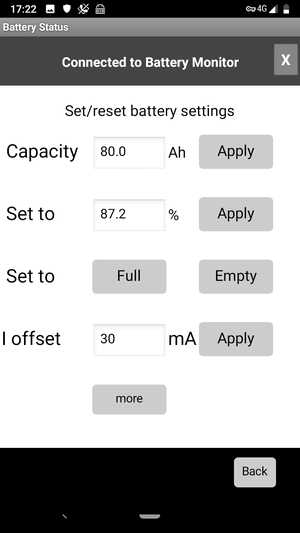

Battery Monitor with low energy Bluetooth readout
=================================================
Measure and display the 
- capacity in Ampere hours (Ah) of a battery
- the voltage of the battery (V)
- the current flowing from/to the battery (A)

of a camper/mobil home 12V battery on an Android Smartphone.

Schematic and borad design in the Eagle folder.

Hardware
========
* ESP32 board
* Current sensor to measure the magnetic field 
* Step-down regulator (DC-DC Buck converter)
  * Input: 10V-20V
  * Output: 5V (fixed or adjustable)
  * Current: 1A
* ADS1115 16 bit ADC

Current Sensor
==============
A split core current sensor with a Hall sensor or a shunt resistor is used to measure the current.

Hall Sensor
-----------
Advantage: sensor works contactless. No need to mess with the cabling, since the sensor is just placed around one of the battery cables.

Utilized model: YHDC HSTS016L +-20A
- 2.5+-0.625V (buffered by an OpAmp) 
- reference voltage 2.5V (buffered by an OpAmp) 

Shunt Resistor
--------------
A commercial shunt suitable for a high current (e.g. 100A) is placed into the ground connection to the battery. The voltage drop is small (e.g. 70mV for 100A).
The ADS1115 allows to change the voltage range down to +-256mV. This makes it suitable to measure the current with sufficient precision.

The reached resolution is for both cases about 50mA.

Analog to digital conversion
============================
Internal 12-bit ADC of the ESP32 processor. The ADC is quite noisy and an averaging (low pass filter) is used in the software 
in order to achieve the resolution of about 50mA.
The ADS1115 16 bit ADC is readily available as a module. It exhibits 4 channels, a wide adjustable voltage range, a build in amplifier and can directly measure voltage differences.  

Android APP
===========
Developed with the MIT App-Inventor2
- Low energy bluetooth (BLE) connection to the ESP32
- Main Screen with current, voltage, capacity
- Settings window 

Software
========
The Arduino IDE is used for the code development.

Requires packages
-----------------
- ESP32 support with BLE and Wire
- ADS1115_WE by Wolfgang Ewald

Concept
-------
- The BLE connection is initialized by the phone
- A sign-on message is expected by the ESP32. This is a hash value of the current time (salt) and a pre-shared pass phrase. 
- If the message is not received, the BLE connection is terminated.
- Data are send to the APP every second as a block of 20 bytes. The values are 16 bit integer values, which have been scaled to reflect the predefined number og significant digits. 

